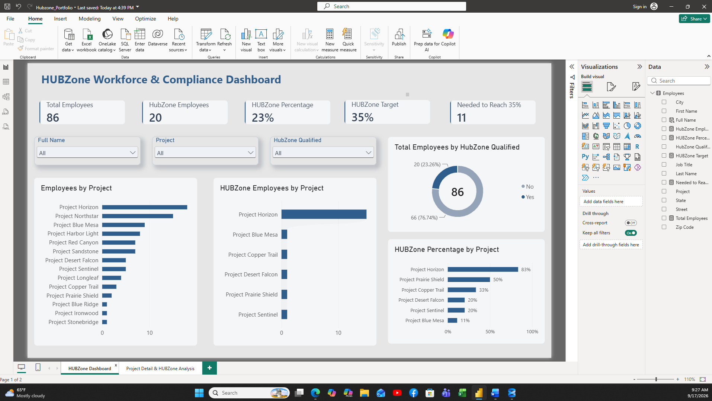
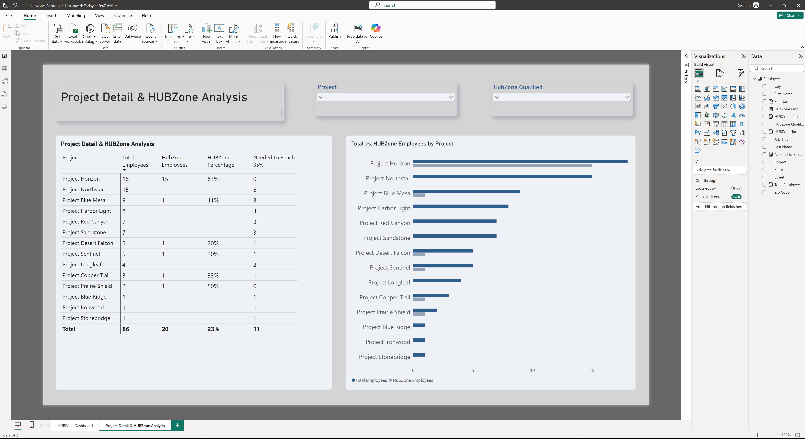

# HUBZone Workforce Compliance Dashboard

## Project Overview
This project analyzes employee workforce data to track HUBZone compliance and identify staffing gaps.

## Key KPIs
- Total Employees
- HUBZone Employees
- HUBZone Percentage
- Employees Needed to Reach 35%

## Tools Used
- Power BI
- Excel
- Power Query
- DAX

## Business Question
How close is the organization to the 35% HUBZone employee requirement, and which projects affect compliance the most?

## Dashboard Preview

### HUBZone Workforce Dashboard

### Project Detail Analysis

## Download the Data

[Download the sanitized HUBZone Excel file](PowerBI_HubZone_SANITIZED_Fake_Data.xlsx)
